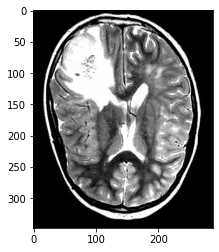

# Kyle MacLaughlin's Resume Projects

## Summary

Here I have compiled into one Jupyter notebook my implementations of a few statistical and machine learning tasks applying common methods to datasets from a variety of fields.

#### Table of Contents

1. [Detecting Tumors With A Deep Convolutional Network](#Detecting-Tumors-With-A-Deep-Convolutional-Network)
2. [A Recommender System For Netflix Movies](#A-Recommender-System-For-Netflix-Movies)
3. [Sentiment Analysis In Product Reviews](#Sentiment-Analysis-In-Product-Reviews)

## Detecting Tumors With A Deep Convolutional Network

### Background

One challenge in modern medicine is identifying tumors and other anomalies on brain MR scans. The goal of developing increasingly sophisticated systems for identifying tumors (and other visible abnormalities) is to aid radiologists in their meticulous searches. In this section, I will create a deep convolutional neural network in order to classify scans as positive (tumorous) or negative (typical).

### Implementation Details

In order to create this model, I downloaded the _Br35H :: Brain Tumor Detection 2020_ image dataset published on Kaggle (https://www.kaggle.com/datasets/ahmedhamada0/brain-tumor-detection) by Ahmed Hamada. This dataset contains two folders labelled "yes" (positive) and "no" (negative), each containing 1500 images of axial slices taken from MR scans. I will segment 2/3 of the data (1000 images from each category) into a training set, and the rest will be placed in the testing set. Only one model will be used (for simplicity), so no validation set is required.


```python
"""
    Written by Kyle MacLaughlin in 2022
    - A deep convolutional classifier model to detect brain tumors -
"""

# Begin with imports

import numpy as np
import pandas as pd
import tensorflow as tf
import matplotlib.pyplot as plt
import matplotlib.image as plt_img

# Load the data
no = [plt_img.imread(f'data/Br35H/no/no{i}.jpg') for i in range(1500)]
yes = [plt_img.imread(f'data/Br35H/yes/y{i}.jpg') for i in range(1500)]
```


    <matplotlib.image.AxesImage at 0x13fa966d0>


    

    


```python
# Peak at first five scans from each category
fig, axs = plt.subplots(2, 5, figsize=(16,6), dpi=200)
fig.suptitle('First five scans', fontsize=24)

for i in range(5):
    mapno = axs[0,i].imshow(no[i])
    mapyes = axs[1,i].imshow(yes[i])
```


    

    


We see immediately that the images have irregular shapes, and therefore we must clean them up.

## A Recommender System For Netflix Movies

### Background
In 2006, Netflix issued a challenge that was hard to ignore: any team that developed a recommender system for movies using data collected by the streaming service that could beat their in-house _Cinematch_ algorithm's error score by at least 10% would receive a $1 million prize. In spite of the competition having ended more than a decade ago, I have decided to put my skills to the test by developing a recommender system of my own using the same dataset.

### Implementation Details
I downloaded the official _Netflix Prize_ dataset published by Netflix on Kaggle (https://www.kaggle.com/datasets/netflix-inc/netflix-prize-data). In this example, I aim to beat the company's original RMSE (root-mean-square error) of 0.9525 as per the [contest rules](https://web.archive.org/web/20100106185508/http://www.netflixprize.com//rules).

## Sentiment Analysis In Product Reviews

### Background
It is often useful to determine more information about users' preferences than merely their binary or numerical ratings of a product or service. For example, a small or mid-sized business might collect data from its customers, but those data might be too sparse to explain the consumers' reasons for making purchases or leaving reviews. In such cases, it is useful to identify latent factors in their thinking, referred to as _sentiment_.


```python

```
