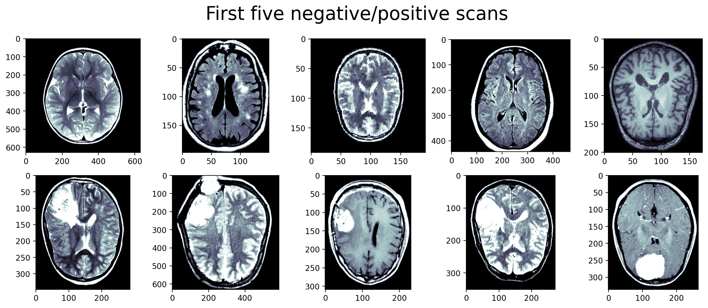
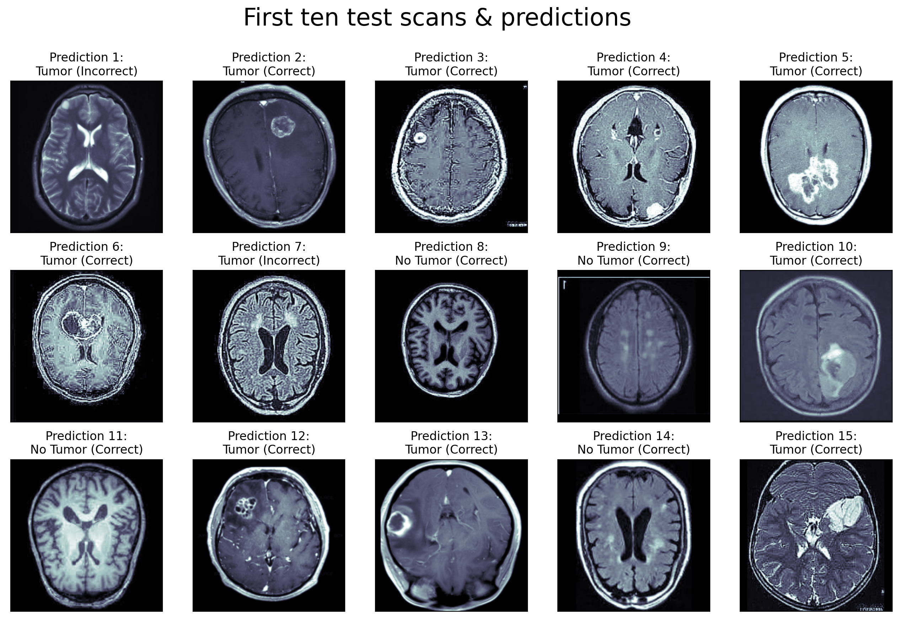

# Kyle MacLaughlin's Resume Projects

### Summary

Here I have compiled into one Jupyter notebook my implementations of a few statistical and machine learning tasks applying common methods to datasets from a variety of fields. Along the way, I include some implementation details and my motivations for choosing them, but I have also included some data visualizations to make the process and results more intuitive.

### Table of Contents

1. [Detecting Tumors With A Deep Convolutional Network](#Detecting-Tumors-With-A-Deep-Convolutional-Network-brainmedical_symbol)
    1. [Results](#Testing-the-Model)
2. [A Recommender System For Netflix Movies](#A-Recommender-System-For-Netflix-Movies-popcorndvd)
    1. [Implementation Details](#Implementation-Details-1)
    2. [Results On Training Set](#Testing-the-Model-1)
    3. [Testing with a Sample User](#Adding-a-New-User)
    4. [Pragmatic Adjustments to the Model](#Pragmatic-Adjustments-to-the-Model)

## Detecting Tumors With A Deep Convolutional Network :brain::medical_symbol:

### Background

One challenge in modern medicine is identifying tumors and other anomalies on brain MR scans. The goal of developing increasingly sophisticated systems for identifying tumors (and other visible abnormalities) is to aid radiologists in their meticulous searches. In this section, I will create a deep convolutional neural network in order to classify scans as positive (tumorous) or negative (typical).

### Implementation Details

In order to create this model, I downloaded the _Br35H :: Brain Tumor Detection 2020_ image dataset published on Kaggle (https://www.kaggle.com/datasets/ahmedhamada0/brain-tumor-detection) by Ahmed Hamada. This dataset contains two folders labelled "yes" (positive) and "no" (negative), each containing 1500 images of axial slices taken from MR scans. I will segment two-thirds of the data (2000 images) into a training set, and the rest will be placed in the test set. Only one model will be used (for simplicity), so no validation set is required.

### Preparing the Data


```python
"""
    Written by Kyle MacLaughlin in 2022
    - A deep convolutional classifier model to detect brain tumors -
"""

# Begin with imports

import numpy as np
import tensorflow as tf
from tensorflow.keras import layers
from tensorflow.keras import Sequential
import matplotlib.pyplot as plt
import matplotlib.image as plt_img
from skimage.transform import resize
```


```python
# Load the data
no = [plt_img.imread(f'data/Br35H/no/no{i}.jpg') for i in range(1500)]
yes = [plt_img.imread(f'data/Br35H/yes/y{i}.jpg') for i in range(1500)]

# Convert each image to normalized grayscale (we can assume no alpha from .jpg)
for i in range(1500):
    if len(no[i].shape) == 3:
        no[i] = np.mean(no[i], axis=(-1,)) / 255
    if len(yes[i].shape) == 3:
        yes[i] = np.mean(yes[i], axis=(-1,)) / 255

# Peak at first five scans from each category
fig, axs = plt.subplots(2, 5, figsize=(16,6), dpi=200)
fig.suptitle('First five negative/positive scans', fontsize=24)

for i in range(5):
    axs[0,i].imshow(no[i], cmap='bone')
    axs[1,i].imshow(yes[i], cmap='bone')
```


    

    


```python
# These images could clearly use some cleanup;
# We will make each image square, then scale it to match the size of the smallest image
data = []

def padded(img):
    r, c = img.shape
    if r == c:
        return img
    elif r > c:
        left = (r - c) // 2
        right = r - c - left
        return np.pad(img, [(0,0), (left, right)])
    else:
        top = (c - r) // 2
        bot = c - r - top
        return np.pad(img, [(top, bot), (0,0)])

for img in no:
    sq_img = padded(img)
    data += [[sq_img, False]]

for img in yes:
    sq_img = padded(img)
    data += [[sq_img, True]]

min([x[0].shape[0] for x in data])
```


    175


```python
# Since the smallest size is 175 x 175, we will resize all images to match this
X = []
y = []

# We will introduce a categorical encoding for outputs:
# negative -> [0,1], positive -> [1,0]
for img,cat in data:
    X += [img if img.shape[0] == 175 else resize(img, (175, 175))]
    y += [[1 * cat, 1 - 1 * cat]]
    
# Make into NumPy arrays with input channel added to shape
X = np.array(X)[:,:,:,None]
y = np.array(y)

# Finally, we will shuffle the data and create training and test sets
indices = list(range(3000))
np.random.shuffle(indices)
X = X[indices]
y = y[indices]

train_X, train_y = X[:2000], y[:2000]
test_X, test_y = X[2000:], y[2000:]
```

### Building & Training the Model

When we finally build our model, we identify increasingly high-level features with a series of convolutional layers, followed by a sudden dimensionality reduction, and we feed this into our output layer. The output layer consists of two units with a softmax activation for our categorical data, which is accompanied by an appropriate binary cross-entropy loss function. For our dimensionality-reduction layers, we include regularization penalties to ensure that parameters do not grow too large.


```python
model1 = tf.keras.Sequential([
    layers.Input((175, 175, 1)),
    layers.Conv2D(64, (3,3)),
    layers.Conv2D(32, (5,5)),
    layers.Conv2D(16, (5,5)),
    layers.Conv2D(8, (7,7), strides=(2,2)),
    layers.Conv2D(4, (7,7), strides=(2,2)),
    layers.Flatten(),
    layers.Dense(50, activation='relu',
                 kernel_regularizer='l2', bias_regularizer='l2'),
    layers.Dense(2, activation='softmax')
], 'Tumor-Detector')

model1.compile(optimizer='adam', loss='binary_crossentropy')
model1.summary()
```

    Model: "Tumor-Detector"
    _________________________________________________________________
     Layer (type)                Output Shape              Param #   
    =================================================================
     conv2d_71 (Conv2D)          (None, 173, 173, 64)      640       
                                                                     
     conv2d_72 (Conv2D)          (None, 169, 169, 32)      51232     
                                                                     
     conv2d_73 (Conv2D)          (None, 165, 165, 16)      12816     
                                                                     
     conv2d_74 (Conv2D)          (None, 80, 80, 8)         6280      
                                                                     
     conv2d_75 (Conv2D)          (None, 37, 37, 4)         1572      
                                                                     
     flatten_14 (Flatten)        (None, 5476)              0         
                                                                     
     dense_29 (Dense)            (None, 50)                273850    
                                                                     
     dense_30 (Dense)            (None, 2)                 102       
                                                                     
    =================================================================
    Total params: 346,492
    Trainable params: 346,492
    Non-trainable params: 0
    _________________________________________________________________


```python
model1.fit(train_X, train_y, batch_size=64, epochs=3)
```

    Epoch 1/3
    32/32 [==============================] - 208s 6s/step - loss: 1.5178
    Epoch 2/3
    32/32 [==============================] - 210s 7s/step - loss: 1.0078
    Epoch 3/3
    32/32 [==============================] - 215s 7s/step - loss: 0.6601


    <keras.callbacks.History at 0x138644970>


### Testing the Model

Now that we have constructed our model and fitted it to the training set, we will put it to the test! We will compute the balanced error rate (BER) of the model on the testing set. This is the mean of the false positive and negative rates, and provides a metric for how well the model generalizes to the rest of the data.


```python
# Make predictions from test set inputs
pred = model1.predict(test_X)

# Ignore confidence levels, apply firm labels
pred = 1 * (pred > 0.5)

# Identify true/false positives & negatives
true = pred * test_y
false = pred * (1 - test_y)

# The column-wise sums yield +/-
tp, tn = np.sum(true, axis=0)
fp, fn = np.sum(false, axis=0)

fpr = fp / (fp + tn) # false positive rate
fnr = fn / (fn + tp) # false negative rate
ber = 0.5 * (fpr + fnr)
print(f'Balanced error rate of model over test set: {ber}')
```

    32/32 [==============================] - 17s 538ms/step
    Balanced error rate of model over test set: 0.09001100990891803


We observe a BER of 0.09, meaning our model is fairly accurate. While this result is not state of the art, it could certainly be useful in the context of flagging potential tumors for radiologists to examine&mdash;especially with a tweak to the classification threshold.


```python
# Peak at first 15 scans from test set and predictions
fig, axs = plt.subplots(3, 5, figsize=(16,10), dpi=200)
fig.suptitle('First fifteen test scans & predictions', fontsize=24)

for i in range(15):
    tumor = 'Tumor' if pred[i,0] > 0 else 'No Tumor'
    corr = 'Correct' if np.sum(pred[i] * test_y[i]) > 0 else 'Incorrect'
    axs[i//5, i%5].imshow(test_X[i,:,:,0], cmap='bone')
    axs[i//5, i%5].set_title(f'Prediction {i+1}:\n{tumor} ({corr})', fontsize=12)
    axs[i//5, i%5].set_xticks([])
    axs[i//5, i%5].set_yticks([])
```


    

    


The model can be found under "models/tumor-detector".

## A Recommender System For Netflix Movies :popcorn::dvd:

### Background
In 2006, Netflix issued a challenge that was hard (for us plebeians) to ignore: any team that developed a recommender system for movies using data collected by the streaming service that could beat their in-house _Cinematch_ algorithm's error score by at least 10% would receive a $1 million prize. In spite of the competition having ended more than a decade ago, I have decided to put my skills to the test by developing a recommender system of my own using the same dataset.

### Implementation Details
I downloaded the official _Netflix Prize_ dataset published by Netflix on Kaggle (https://www.kaggle.com/datasets/netflix-inc/netflix-prize-data). In this example, I aim to beat the company's original RMSE (root-mean-square error) of 0.9525 as per the [contest rules](https://web.archive.org/web/20100106185508/http://www.netflixprize.com//rules). Unfortunately, as the test set is not provided, I will only be able to test my model on the training set. For this model, I will use a basic function based on one that was demonstrated in my recommender systems class. _Be forewarned: there will be a lot of math ahead (feel free to skip to the code/results)._

The model in question is a function of the average rating across the database (the mean of every rating made), each user's average deviation from the mean, each movie's average deviation from the mean, and an alignment score between the user and the movie. Here is the function in all of its (Greek) glory:

$$f(u,m) = \mu + \delta_u + \delta_m + \gamma (\alpha_u \cdot \beta_m) \qquad \text{where } ||\alpha_u|| = ||\beta_m|| = 1$$

where $\mu$ is the average rating, $\delta_u$ is user $u$'s average deviation from the mean, $\delta_m$ is movie $m$'s average deviation from the mean, $\alpha_u,\,\beta_m \in \mathbb{R}^k$ are the respective vector representations of the user and the movie, restricted to the $k$-dimensional unit sphere, and $\gamma$ is the universal coefficient determining the importance of the alignment score. The loss function we are trying to minimize is the RMSE with a small regularization penalty applied, given by

$$L(\alpha, \beta, \gamma, \delta) = \sqrt{\sum_{u,m} \left(f(u,m) - R_{u,m}\right)^2 + \lambda \left(\sum_u \delta_u^2 + \sum_m \delta_m^2 + \gamma\right)}$$

where we are taking $R_{u,m}$ to be user $u$'s most recent rating of movie $m$. Additionally, since this value is only defined for pairings $u,m$ with defined rating value, the sum will be restricted only to such user-movie pairs. We apply the regularization within the root to avoid focusing too much on it compared to the error.

The optimization method we will apply entails setting the partial derivative of the loss with respect to each parameter equal to zero, then updating each parameter according to its closed form solution. Therefore, we begin by computing these derivatives.

$$\frac{\partial L}{\partial \delta_v} = \frac{2 \cdot \sum_m \left(f(v,m) - R_{v,m}\right) + 2 \lambda \delta_v}{2L} = \frac{(M + \lambda) \delta_v + \sum_m \left(\mu + \delta_m + \gamma (\alpha_v \cdot \beta_m) - R_{v,m}\right)}{L} = 0$$

$$\implies \delta_v = \frac{\sum_m \left(R_{v,m} - \mu - \delta_m - \gamma (\alpha_v \cdot \beta_m)\right)}{M + \lambda} \qquad \text{where user } v \text{ rated } M \text{ movies}$$

$$\frac{\partial L}{\partial \delta_n} = 0 \implies \delta_n = \frac{\sum_u \left(R_{u,n} - \mu - \delta_u - \gamma (\alpha_u \cdot \beta_n)\right)}{U + \lambda} \qquad \text{where movie } n \text{ was rated by } U \text{ users}$$

$$\frac{\partial L}{\partial \gamma} = \frac{2 \cdot \sum_{u,m} \left(\mu + \delta_u + \delta_m + \gamma (\alpha_u \cdot \beta_m) - R_{u,m}\right) \alpha_u \cdot \beta_m + \lambda}{2L} = 0$$

$$\implies \gamma = \frac{\sum_{u,m} \left(R_{u,m} - \mu - \delta_u - \delta_m\right) \alpha_u \cdot \beta_m - \lambda/2}{\sum_{u,m} (\alpha_u \cdot \beta_m)^2}$$

$$\frac{\partial L}{\partial \alpha_v} = \frac{2\gamma \cdot \sum_m \left(f(v,m) - R_{v,m}\right) \beta_m}{2L} = \vec{0}$$

$$\implies \sum_m (\alpha_v^T \beta_m) \beta_m^T = \alpha_v^T \cdot \sum_m \beta_m \beta_m^T = \gamma^{-1} \cdot \sum_m \left(R_{v,m} - \mu - \delta_v - \delta_m\right) \beta_m^T$$

$$\implies \alpha_v = \gamma^{-1} \left(\sum_m \beta_m \beta_m^T\right)^{-1} \cdot \sum_m \left(R_{v,m} - \mu - \delta_v - \delta_m\right) \beta_m$$

Although the individual terms in the outer-product sum of movie alignments are all singular, it is highly improbable that the sum is (so we assume the inverse exists). Moreover, since the end result will also be normalized (to maintain the condition that the alignment vectors reside on the unit sphere), we will ignore the division by $\gamma$. Likewise,

$$\frac{\partial L}{\partial \beta_{ni}} = 0 \implies \beta_n = \gamma^{-1} \left(\sum_u \alpha_u \alpha_u^T\right)^{-1} \cdot \sum_u \left(R_{u,n} - \mu - \delta_u - \delta_n\right) \alpha_u$$

We will randomly initialize the parameters, then repeatedly optimize the user parameters, the movie parameters, and the alignment coefficient.

### Preparing the Data
Netflix informs on the Kaggle page where the data are listed that there are 480,189 users with nonconsecutive IDs. In order to efficiently represent data, I will only use a users-per-movie representation of ratings data, but will convert the users to an index-based system for ease of use.


```python
# Initialize ratings
raw_ratings = {}

# For indexing users
id_to_index = {}

def read_values(f):
    mov_no = -1 # Filler
    r = []
    user_count = len(id_to_index)
    
    # Read lines from file
    for line in f.readlines():
        if line[-2] == ':':
            if mov_no == -1: mov_no = int(line[:-2])
            else:
                if mov_no in raw_ratings.keys():
                    raw_ratings[mov_no] += r
                else:
                    raw_ratings[mov_no] = r
                    
                mov_no = int(line[:-2])
                r = []
        else:
            user, rating = line.split(',')[:2]
            user, rating = int(user), int(rating)
            
            if user in id_to_index:
                user = id_to_index[user]
            else:
                id_to_index[user] = user = user_count
                user_count += 1
                
            r += [[user, rating]]
    
    # Add last ratings to dictionary and close file
    raw_ratings[mov_no] = r
    f.close()

# Read data from files
for i in range(4):
    with open(f'data/Netflix/combined_data_{i+1}.txt', 'r', 4000000) as f:
        read_values(f)

        
# Ensure movie ratings are in order
movies = list(raw_ratings.keys())
movies.sort()
    
# Update ratings to array structure for efficiency
ratings = []
for movie in movies:
    ratings += [np.sort(raw_ratings.pop(movie), axis=0)]

# Keep track of movie ratings by each user
ratings_by_user = [[] for _ in range(len(id_to_index))]
for m, movie in enumerate(ratings):
    for n, pair in enumerate(movie):
        ratings_by_user[pair[0]] += [[m, pair[1]]]
        
# Convert ratings_by_user to use numpy for speed
for u, user in enumerate(ratings_by_user):
    ratings_by_user[u] = np.array(user)
```

We have clearly collected our ratings of the 17,770 movies provided by Netflix, but there's a catch: these ratings are more accesible by movie than by user. Ordinarily, I might convert this data structure into a ratings matrix (of size users-by-movies), but owing to the memory restrictions of my laptop, I will be relying on searches for users instead (drastically slowing computations).

### Building & Training the Model

Since the users' IDs are sparse, we will represent per-user parameters as dictionaries. The per-movie parameters will more naturally be expressed as lists. However, we will first compute mu (the average rating across the dataset).


```python
ratings_count = 0
ratings_total = 0

for movie in ratings:
    ratings_count += len(movie)
    ratings_total += np.sum(movie, axis=0)[1]
    
mu = ratings_total / ratings_count
mu
```


    3.604289964420661


```python
# Size of alignment vectors
K = 10

# Ratings deltas
du = np.random.normal(size=len(id_to_index))
dm = np.random.normal(size=len(ratings))

# User/movie alignments
au = np.random.normal(size=(len(id_to_index), K))
bm = np.random.normal(size=(len(ratings), K))

# Alignment coefficient
gam = 1
```

Here, we will define functions for rating and for the update steps. Since the movie parameters converge relatively quickly, we will estimate user parameter updates using a sample of up to 10 movies the user has rated (for speed).


```python
# Returns the user-movie rating prediction from the model
def rate(user, movie):
    return mu + du[user] + dm[movie] + gam * (au[user] @ bm[movie].T)

# Updates dm and bm by one step (l is reg. constant)
def update_movies(l=0.001):
    for m, movie in enumerate(ratings):
        # Users who rated movie & count thereof
        users = movie[:,0]
        num_users = len(users)

        # Alignment vectors
        alpha = au[users]
        beta = bm[m]
        
        # Shared computation between params
        diff = movie[:,1] - mu - du[users]

        # Update delta_movie
        total_delta = np.sum(diff - gam * (alpha @ beta))
        dm[m] = total_delta / (num_users + l)

        # Update beta_movie (inverse only exists for # users > K)
        total_beta = (diff - dm[m]) @ alpha
        if num_users > K:
            np.linalg.inv(alpha.T @ alpha) @ total_beta
            
        bm[m] = total_beta / np.linalg.norm(total_beta)
    
# Updates du and au by one step (l is reg. constant)
def update_users(l=0.001):
    for u, user in enumerate(ratings_by_user):
        # Movies rated by user & count thereof
        movies = user[:,0]
        num_movies = len(movies)

        # Alignment vectors
        alpha = au[u]
        beta = bm[movies]
        
        # Shared computation between params
        diff = user[:,1] - mu - dm[movies]

        # Update delta_user
        total_delta = np.sum(diff - gam * (beta @ alpha))
        du[u] = total_delta / (num_movies + l)
        
        # Update alpha_user (inverse only exists for # movies > K)
        total_alpha = (diff - du[u]) @ beta
        if num_movies > K:
            total_alpha = np.linalg.inv(beta.T @ beta) @ total_alpha
            
        au[u] = total_alpha / np.linalg.norm(total_alpha)
    
# Updates gamma by one step (l is reg. constant)
def update_gamma(l=0.001):
    # Numerator & denominator of update fraction
    top = -0.5 * l
    bot = 0
    
    for m, movie in enumerate(ratings):
        # Variables for ease of use
        beta = bm[m]
        users, r = movie.T
        alpha = au[users]
        
        # Increment counts
        top += np.sum((r - mu - du[users] - dm[m]) * (alpha @ beta))
        bot += np.sum((alpha @ beta)**2)
    
    # The culmination of all the previous lines of the function
    gam = top/bot
```

At last, it is time to train the recommender system. We will test the _rate_ function to get the average predicted review of the first movie over all users who rated that film. As the model is untrained, we expect a noisy, perhaps impossible result. We shall compare this to the true average rating.


```python
mean_first_rating = 0
mean_pred_rating = 0
Z = 1/len(ratings[0])

for user, rating in ratings[0]:
    mean_first_rating += rating * Z
    mean_pred_rating += rate(user, 0) * Z
    
print(f'Actual mean rating: {mean_first_rating}, mean predicted rating: {mean_pred_rating}')
```

    Actual mean rating: 3.749542961608765, mean predicted rating: 2.8928024488956052


Now, we run the training algorithm for a naive 5 iterations to allow the algorithm to converge.


```python
for i in range(5):
    print(f'-- Iteration {i+1} --')
    update_movies()
    print('Updated movies.')
    update_users()   
    print('Updated users.')
    update_gamma()
    print('Updated alignment coefficient.\n')
```

    -- Iteration 1 --
    Updated movies.
    Updated users.
    Updated alignment coefficient.
    
    -- Iteration 2 --
    Updated movies.
    Updated users.
    Updated alignment coefficient.
    
    -- Iteration 3 --
    Updated movies.
    Updated users.
    Updated alignment coefficient.
    
    -- Iteration 4 --
    Updated movies.
    Updated users.
    Updated alignment coefficient.
    
    -- Iteration 5 --
    Updated movies.
    Updated users.
    Updated alignment coefficient.
    


```python
new_mean_pred_rating = 0
Z = 1/len(ratings[0])

for user, rating in ratings[0]:
    new_mean_pred_rating += rate(user, 0) * Z
    
print(f'Actual mean rating: {mean_first_rating}, new mean predicted rating: {new_mean_pred_rating}')
```

    Actual mean rating: 3.749542961608765, new mean predicted rating: 3.7711829484089345


### Testing the Model

We see that the model's rating predictions for the first movie improve after training, but we would like to know precisely how accurate the model is at predicting ratings for user-movie pairs across the dataset. Therefore, we will measure the RMSE, but this time without regularization.

$$L(\alpha, \beta, \gamma, \delta) = \sqrt{\sum_{u,m} \left(f(u,m) - R_{u,m}\right)^2}$$


```python
def rmse():
    top = 0
    bot = 0
    for m, movie in enumerate(ratings):
        top += np.sum((rate(movie[:,0], m) - movie[:,1])**2)
        bot += len(movie)
    
    return np.sqrt(top/bot)

print(rmse())
```

    0.2123475153953981


As we can see, the model fairs well over the entire training set, reaching an RMSE of 0.2123&mdash;lower than Netflix's 0.9525. While the error on the test set would surely be higher, good generalization could be achieved with a proper tuning of the regularization parameter.

### Adding a New User

Now that we have trained the model, we can simulate a cold start scenario (i.e. a new user joins the service). First, we'll make some general recommendations (without user parameters). We begin by loading the movie titles from the appropriate file.


```python
from csv import reader

# Peaking at the csv file, we know
# the movie titles are in order
titles = []

with open('data/Netflix/movie_titles.csv', 'r', encoding='ISO-8859-1') as f:
    csv_f = reader(f, delimiter='\n')
    for row in csv_f:
        titles += [','.join(row[0].split(',')[2:])]
    
f.close()
titles = np.array(titles)
```

One way to make recommendations in this scenario is to find the movies that have the highest $\delta_m$ values.


```python
print('Your recommendations:')
for title in titles[np.argsort(dm)[:-10:-1]]:
    print(title)
```

    Your recommendations:
    The Rise and Fall of ECW
    Lord of the Rings: The Return of the King: Extended Edition: Bonus Material
    Character
    Dinosaur Planet
    Isle of Man TT 2004 Review
    ECW: One Night Stand
    WWE: Mick Foley's Greatest Hits and Misses
    WWE: Rob Van Dam: One of a Kind
    ECW: Heatwave '98


It seems like Netflix subscribers in 2006 were into wrestling (or wrestling shows received the highest praise from their most loyal fans), but we can make tailored recommendations as well. We will now suppose that our new user has rated some titles, which we will use to improve our recommendations. In this example, our new customer leaves high ratings for sci-fi and fantasy movies, but low ones for wrestling.

__Example Ratings__
- _Lord of the Rings: The Return of the King: Extended Edition: Bonus Material_ (#12) - 5
- _Lord of the Rings: The Return of the King: Extended Edition_ (#14960) - 5
- _The Lord of the Rings: The Fellowship of the Ring: Extended Edition_ (#7229) - 5
- _Lord of the Rings: The Two Towers: Extended Edition_ (#7056) - 4
- _The Twilight Zone: Vol. 36 (#576)_ - 3
- _Ghost in the Shell: Stand Alone Complex: 2nd Gig_ (#3032) - 4
- _Battlestar Galactica: Season 1_ (#9863) - 5
- _ECW: Guilty as Charged 2001 (#5380)_ - 1
- _WWE: Summerslam 2003_ (#4141) - 1
- _The Simpsons: Season 5_ (#5102) - 3
- _Gattaca (#17761)_ - 5


```python
# Initialize parameters and ratings data
du_new = np.random.normal()
au_new = np.random.normal(size=K)

ratings_by_new_user = np.array([[12, 5], [14960, 5], [7229, 5], [7056, 4],
                       [576, 3], [3032, 4], [9863, 5], [5380, 1],
                       [4141, 1], [5102, 2], [17761, 5]])

# Learn parameters for model
for i in range(10):
    # Movies rated by user & count thereof
    movies = ratings_by_new_user[:,0]
    num_movies = len(movies)

    # Alignment vectors
    beta = bm[movies]

    # Shared computation between params
    diff = ratings_by_new_user[:,1] - mu - dm[movies]

    # Update delta_new
    total_delta = np.sum(diff - gam * (beta @ au_new))
    du_new = total_delta / num_movies

    # Update alpha_new
    total_alpha = (diff - du_new) @ beta
    if num_movies > K:
        total_alpha = np.linalg.inv(beta.T @ beta) @ total_alpha

    au_new = total_alpha / np.linalg.norm(total_alpha)
```

Now that we've trained the new user parameters, let us examine the new recommendations.


```python
new_ratings = mu + du_new + dm + gam * (au_new @ bm.T)

print('Your recommendations:')
for title in titles[np.argsort(new_ratings)[:-10:-1]]:
    print(title)
```

    Your recommendations:
    Lord of the Rings: The Return of the King: Extended Edition: Bonus Material
    The Rise and Fall of ECW
    Character
    Dinosaur Planet
    Isle of Man TT 2004 Review
    ECW: One Night Stand
    WWE: Mick Foley's Greatest Hits and Misses
    WWE: Rob Van Dam: One of a Kind
    WWE: Survivor Series 2002


The recommendations are largely the same (just reordered), which may be a consequence of overfitting to the initial training set. Therefore, we might want to experiment with the system by assigning less weight to the movie delta and more to the alignment coefficient. We will explore recommendations for a few different parameter weightings.

### Pragmatic Adjustments to the Model


```python
for i in range(4):
    w = 0.5**i
    new_ratings = du_new + w * dm + (1-w) * gam * (au_new @ bm.T)
    
    print(f'Your recommendations (dm/gam = 1/{2**(i+1) - 1}):')
    for title in titles[np.argsort(new_ratings)[:-6:-1]]:
        print(title)
    
    print()
```

    Your recommendations (dm/gam = 1/1):
    The Rise and Fall of ECW
    Lord of the Rings: The Return of the King: Extended Edition: Bonus Material
    Character
    Dinosaur Planet
    Isle of Man TT 2004 Review
    
    Your recommendations (dm/gam = 1/3):
    Lord of the Rings: The Return of the King: Extended Edition: Bonus Material
    The Rise and Fall of ECW
    Character
    Dinosaur Planet
    Isle of Man TT 2004 Review
    
    Your recommendations (dm/gam = 1/7):
    Lord of the Rings: The Return of the King: Extended Edition: Bonus Material
    The Rise and Fall of ECW
    Fortunes of War
    The Land Before Time VI: The Secret of Saurus Rock
    Dinosaur Planet
    
    Your recommendations (dm/gam = 1/15):
    Fortunes of War
    The Land Before Time VI: The Secret of Saurus Rock
    Sherlock Holmes: The Last Vampyre
    MacArthur
    Changi
    


We see that as the emphasis shifts from generally popular items to items that align with the user's ratings, higher quality recommendations are made. In practice, it appears that the last weighting is best, as it includes items likely to appeal to the user's genre preferences while avoiding those that have received lower ratings. A better model would disproportionately weight a user's extremal preferences.


```python

```
