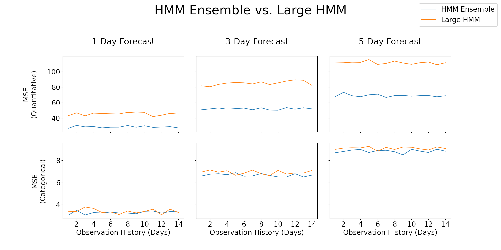
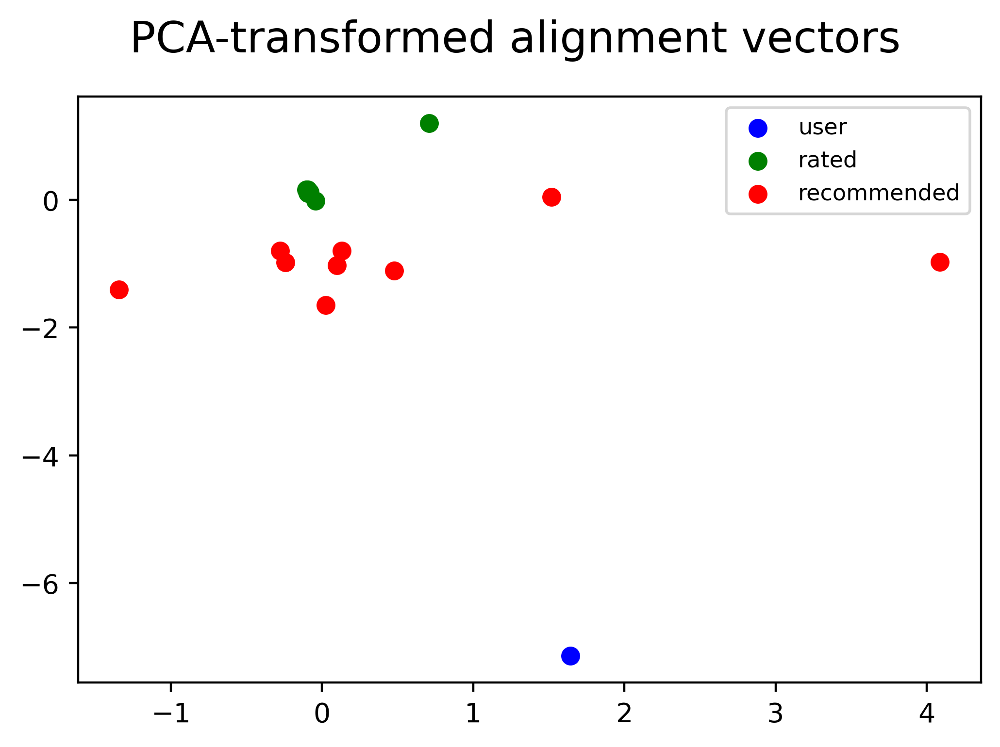

# Kyle MacLaughlin's Portfolio

## About Me
I am a data scientist in San Diego, CA and just completed my bachelor's degree in Mathematics - Computer Science from UC San Diego, so I am actively seeking work. You can reach me at my email (kylemaclaughlin@gmail.com), by phone (614-800-5676), or [on LinkedIn](https://www.linkedin.com/in/kyle-maclaughlin/). I am willing to travel and/or relocate.

## About This Portfolio
I aim to highlight some of my data analysis and machine learning skills by applying common methods to datasets from multiple domains. Along the way, I will include implementation details and my motivations for choosing them, but I have also included some data visualizations to make the process and results more intuitive. You can find the notebooks in this repository, but I will also summarize my results here.

## Table of Contents

1. [Detecting Tumors With A Deep Convolutional Network](#Detecting-Tumors-With-A-Deep-Convolutional-Network-brainmedical_symbol)
2. [Weather Prediction With A Hidden Markov Model](#Weather-Prediction-With-A-Hidden-Markov-Model-sunnyumbrella)
3. [A Recommender System For Netflix Movies](#A-Recommender-System-For-Netflix-Movies-popcorndvd)

## Detecting Tumors With A Deep Convolutional Network :brain::medical_symbol:

### Background

One challenge in modern medicine is identifying tumors and other anomalies on brain MR scans. The goal of developing increasingly sophisticated systems for identifying tumors (and other visible abnormalities) is to aid radiologists in their meticulous searches. In this project, I created a deep convolutional neural network in order to classify scans as positive (tumorous) or negative (typical).

### Implementation Details

In order to create the model, I downloaded the _Br35H :: Brain Tumor Detection 2020_ image dataset published on Kaggle (https://www.kaggle.com/datasets/ahmedhamada0/brain-tumor-detection) by Ahmed Hamada. This dataset contains two folders labelled "yes" (positive) and "no" (negative), each containing 1500 images of axial slices taken from MR scans. I segmented two-thirds of the data (2000 images) into a training set, and the rest were be placed in the test set. Only one model was be used (for simplicity), so no validation set was required. After appropriately resizing the images to a standard size of $175 \times 175$, I created the following model:

    Model: "Tumor-Detector"
    _________________________________________________________________
     Layer (type)                Output Shape              Param #   
    =================================================================
     conv2d (Conv2D)             (None, 173, 173, 64)      640       
                                                                     
     conv2d_1 (Conv2D)           (None, 169, 169, 32)      51232     
                                                                     
     conv2d_2 (Conv2D)           (None, 165, 165, 16)      12816     
                                                                     
     conv2d_3 (Conv2D)           (None, 80, 80, 8)         6280      
                                                                     
     conv2d_4 (Conv2D)           (None, 37, 37, 4)         1572      
                                                                     
     flatten (Flatten)           (None, 5476)              0         
                                                                     
     dense (Dense)               (None, 50)                273850    
                                                                     
     dense_1 (Dense)             (None, 2)                 102       
                                                                     
    =================================================================
    Total params: 346,492
    Trainable params: 346,492
    Non-trainable params: 0
    _________________________________________________________________

### Results
On one particular execution of the notebook, my model acheived an area under the ROC curve (AUC-ROC) of 0.941, and typical executions had an AUC > 0.95. This means that for most classification thresholds, the true positive rate was far greater than the false positive rate. For the application of flagging cases for review by radiologists, it might be best to have a relatively low classification threshold (at the risk of including more false positives). Here are the ROC curve and the first fifteen scans in the shuffled dataset, along with the classifier's predictions under the optimal threshold.

 

 

## Weather Prediction With A Hidden Markov Model :sunny::umbrella:

### Background
An issue of major concern in the domain of transportation and public safety is the occurrence of inclement weather, which is often important to know at least a day in advance. However, as is common knowledge, predicting the weather is not easy, especially in some areas where the weather is relatively volatile. Therefore, I decided to make models that could predict the sometimes wildly unpredictable weather in my hometown of Columbus, Ohio simply by examining real-world weather data from the previous few days.

Predicting the weather has always proven elusive, lying somewhere between the often preferred domains of pure chance and an easily foreseen chain of events. Such processes are common in our world, and statisticians have accordingly devised models to assist in the description of such semi-random processes. One such model is the hidden Markov model (HMM), which has applications in such varied domains as speech recognition, biology and finance, so I decided to implement it in order to predict weather patterns in Columbus.

### Exploration of the Dataset
Before building models, I cleaned up the data and created visualizations of them to view trends in the dataset, several of which can be seen to the right.

### Implementation Details
An HMM of a temporal process (in this case, the weather) makes two key modeling assumptions:

 - The probability of any *observable* outcome (e.g. a rainy day) is exclusively dependent on a *hidden* (unobservable) state of the system (e.g. the movement of every molecule in the sky)

- The current hidden state of the process *only depends on its recent past* (e.g. yesterday's weather)

It made sense to use such a model since the weather has a hidden state (the motion of every wind & water current on Earth) that can be approximated and a series of well-defined outcomes (temperatures, winds, precipitation, etc.) that exclusively depend on that hidden state. Weather data were gathered from the [National Centers for Environmental Information's Climate Data Online](https://www.ncdc.noaa.gov/cdo-web/) for Jan. 1, 2012 to Dec. 27, 2022, with units given in the imperial system (US standard). I trained models on the data from 2012 - 2020 and tested them on the data from 2021 - 2022.

### Results
I derived an [expectation-maximization algorithm](https://en.wikipedia.org/wiki/Expectation–maximization_algorithm) for use with my models, and I trained both an ensemble of smaller models and a single larger model to see which would fare better. After the parameters were learned, I compared the prediction errors of the ensemble and the lone HMM on test data, feeding in 1-14 days of previous weather data per prediction. As we might expect, the error increases as we attempt to predict the weather for longer timespans.

  

Finally, I randomly selected three random date ranges and had each model generate ten 3-day forecasts for each provided weather history. In the graphs below, the predicted values to the left of the actual quantities represent the ensemble's predictions while those to the right constitute the large HMM's predictions.

 

## A Recommender System For Netflix Movies :popcorn::dvd:

### Background
In 2006, Netflix issued a challenge that was hard (for us plebeians) to ignore: any team that developed a recommender system for movies using data collected by the streaming service that could beat its in-house *Cinematch* algorithm's error score by at least 10% would receive a $1 million prize. In spite of the competition having ended more than a decade ago, I decided to put my skills to the test by developing a recommender system of my own using the same dataset.

### Implementation Details
I downloaded the official _Netflix Prize_ dataset published by Netflix on Kaggle (https://www.kaggle.com/datasets/netflix-inc/netflix-prize-data). In this example, I aim to beat the company's original RMSE (root-mean-square error) of 0.9525 as per the [contest rules](https://web.archive.org/web/20100106185508/http://www.netflixprize.com//rules). Unfortunately, as the test set is not provided, I was only be able to test my model on the training set. For this model, I used a basic function based on one that was demonstrated in my recommender systems class.

The model in question is a function of the average rating across the database, each user's average deviation from the mean, each movie's average deviation from the mean, and an alignment score between the user and the movie. The function is given by

$$f(u,m) = \mu + \delta_u + \delta_m + \alpha_u \cdot \beta_m$$

where $\mu$ is the average rating, $\delta_u$ is user $u$'s average deviation from the mean, $\delta_m$ is movie $m$'s average deviation from the mean, and $\alpha_u,\beta_m \in \mathbb{R}^k$ are the respective $k$-dimensional vector representations of the user and the movie (whose dot product constitutes an alignment score). The goal is to minimize the mean squared error (MSE) since it is equivalent to minimizing the RMSE, and I included a regularizer in the loss function for generalization. This loss function is given by

$$L(\alpha, \beta, \delta) = \underbrace{\sum_{u,m} \left(f(u,m) - R_{u,m}\right)^2}_{\text{MSE}} + \underbrace{\lambda\left(\sum_u \delta_u + \sum_m \delta_m + \sum_u ||\alpha_u||_2^2 + \sum_m ||\beta_m||_2^2\right)}_{\text{regularizer}}$$

where we are taking $R_{u,m}$ to be any of user $u$'s ratings of movie $m$ (permitting duplicates). Additionally, since this rating value is only defined for certain pairings, the sum was restricted only to such user-movie pairs. The optimization method I applied entails setting the partial derivative of the loss with respect to each parameter equal to zero, then updating each parameter according to its closed form solution. This strategy of finding the optimal solution is known as alternating least squares.

### Results
In the end, I examined the significance of the learned parameters in the output of the recommender system. For example, a recommendation based only on movie popularity would be useful for a user whose preferences have not been learned. The model found these to be the 9 movies with the highest predicted ratings across the dataset:

    Larryboy and the Rumor Weed
    Isle of Man TT 2004 Review
    Dinosaur Planet
    Paula Abdul's Get Up & Dance
    The Land Before Time VI: The Secret of Saurus Rock
    Sick
    Character
    The Rise and Fall of ECW
    Clifford: Clifford Saves the Day! / Clifford's Fluffiest Friend Cleo

I then performed principal component analysis (PCA) to reduce the dimensionality of the alignment vectors to a plane so they could be visualized.

Two key insights can be taken from these data. The first is that the movie alignment vectors seem to remain roughly normally distributed, while the user alignment vectors are indeed clustered. This suggests that the movies have largely defined the dimensions of the alignment space, not the users. The second is that the movie alignments are close to the origin, while the user alignments are more spread out. We can infer that the model has learned that some users' preferences are not particularly strong, while others are extremely opinionated, and that it is usually best to let the user parameters determine the alignment score's magnitude.

I then fed the model sample ratings for a new user and learned their parameters to make more relevant predictions.

**Sample Ratings**
- _Lord of the Rings: The Return of the King: Extended Edition: Bonus Material_ (#12) - 5
- _Lord of the Rings: The Return of the King: Extended Edition_ (#14960) - 5
- _The Lord of the Rings: The Fellowship of the Ring: Extended Edition_ (#7229) - 5
- _Lord of the Rings: The Two Towers: Extended Edition_ (#7056) - 4
- _The Twilight Zone: Vol. 36 (#576)_ - 3
- _Ghost in the Shell: Stand Alone Complex: 2nd Gig_ (#3032) - 4
- _Battlestar Galactica: Season 1_ (#9863) - 5
- _Gattaca (#17761)_ - 5

From these ratings, the model learned parameters which led to the following recommendations:

    Isle of Man TT 2004 Review
    Paula Abdul's Get Up & Dance
    My Bloody Valentine
    Dinosaur Planet
    Lilo and Stitch
    Boycott
    Daydream Obsession
    Immortal Beloved
    The Land Before Time VI: The Secret of Saurus Rock

My final analysis was on the recommendations made according to various weightings of the movie popularity and the user-movie alignment score. I plotted the PCA projections of the user's vector, the rated movies' vectors, and the recommended movies' vectors. The figure on the left shows the alignment vectors of movies recommended according to the alignment score alone, while the figure on the right shows those of movies recommended according to their popularity scores alone.

In this image, we see the tradeoff between prioritizing item popularity and prioritizing user-item alignment.
